# Examining Tracking Algorithms

by James O&#39;Connor
ENG09022 – Multi-Modal Sensor Systems
_IT Sligo_

**_Abstract_—This report examines some of the popular algorithms used for localization and tracking, including the Kalman filter, Extended Kalman filter, Unscented Kalman filter and the Particle filter. The algorithms were examined using three separate configurations of a time-of-arrival sensor network over a five second time period. Out of the four algorithms investigated, the particle filter was the least performant.**

**Keywords—Localization, Tracking, Kalman Filter, Extended Kalman Filter, Unscented Kalman Filter, Particle Filter**

## I. Introduction

Localization and tracking technologies are widely used in a multitude of applications across various industries. Macro-localization technologies like GPS and other GNSS services have been in operation since the 1980s. Other technologies like RADAR systems date back as far the 1930s. Most of these localization and tracking technologies are based on the same principles; taking measurements of the distance between a source and a target at discrete intervals and using this measurement to calculating the distance between them. The goal of this paper is to examine and compare the performances of a number of popular algorithms for the purpose of localization and tracking including the Kalman filter, Extended Kalman filter, Unscented Kalman filter and the Particle filter. The report outlines why we need filtering algorithms, followed by an overview of the algorithms and then the results of the localization and tracking simulations ran in MATLAB.

## II. Problem Statement

As stated, the basic concept of many localization and tracking distances is a periodic distance measurement between two targets. However, in many cases these measurements may become unavailable periodically, making it no longer possible to localize and track the target. An example of this is a car driving through a tunnel or through a large city where the GPS signal may become unavailable. Similarly RADAR cannot track objects that the radio waves cannot reach that have become occluded. This becomes problematic and leads to inaccuracies and safety issues using these technologies.

Dead-Reckoning (DR) is a technology used to solve for this. DR involves using measurements typically from on-board inertial sensors to update positioning and orientation without the requirement for localization and tracking infrastructure. This is a good alternative, however without any ground truth, errors in this approach can accumulate over time and DR technology is typically not used on its own. However, using DR in combination with localization and tracking technologies like GPS and RADAR can be used to alleviate their respective shortcomings; DR can be used to manage the state estimation when the measurements from localization technologies are not available and the same technologies can be used to provide the ground truths necessary to correct the error accumulation in DR. This fusion is where filtering algorithms are used.

### A. Experiment Set-Up

To test the localization and tracking, a target is simulated moving through a 2D world through a network of sensors. MATLAB was used to create the simulation environment, using the Statistical Sensor Fusion toolbox. A standard Time-Of-Arrival (TOA) sensor model was used. The TOA sensors return a range measurement between themselves and the target. In this simulation four sensors were used and a single target created as follows: The motion model used was the coordinated turn cartesian velocity model. Three orientations of sensors were simulated to test the impact of the sensor positions.

The goal of these simulations is to compare the performances of the algorithms. Therefore each algorithm will be tested in the same simulated environment and their performance will be compared against the Cramer-Rao Lower Bound, which is the lower estimate for the variance of an estimator.

## III. Overview of Algorithms

### A.The Kalman Filter

The Kalman Filter (KF) is a filtering algorithm that is discussed in this paper that provides estimates of unknown states or variables given a set of measurements observed [1]. It was introduced in 1960 [2]. The algorithm uses state space models to model the dynamics of a linear system. The state space model represents the model of the process model and the measurement model. The dynamic process model (e.g. a model describing physical laws of motion) describes the relationship between the current state and the state of the variables at a previous time step. The measurement or observation model describes the measurement from sensors at the current time step.

The process model is outlined as:

X represents the state position, F is the transition matrix, B is the control-input matrix, u is the control vector and w is process noise and. The control input matrix represents any inputs to the system, for example any forces applied. The noise represented by w is representative of any noisy measurements or estimations in the dynamic process. In the linear Kalman filter, this is a linear relationship.

The measurement model is:

Where z is the measurement, H is the measurement Matrix and v represents the measurement noise.

The process model and the measurement model are continuously compared the estimated state with the measurements and adjusting accordingly. This happens in two steps - predict and update. The relationship between the predicted and updated can be described in multiple ways but for positioning, it is usually represented in terms of change in position, velocity and acceleration between time steps.

The Kalman filter is known to be the best filtering algorithm for linear operations.

### B. The Extended Kalman Filter (EKF)

In many cases, such as the multi-modal case, our state equations cannot be reduced to linear operations. The extended Kalman filter is an extension of the classic KF to account for this non-linearity. This means that the relationship between the prior and posterior states cannot be described using multiplication of vectors, such as the case in the process and measurement model for the KF. Instead of modelling the previous state using a control-input matric and a transition matrix, the state equations are linearized using their first or second order derivatives around their current state estimate i.e. an approximation value. This is good for accounting for multi-modal systems. Some disadvantages of the EKF is that for highly non-linear estimation functions, it is difficult to calculate the Jacobian matrix and can be computationally expensive. Similarly, non-linear functions can be hard to approximate accurately with a linear approximation.

### C. The Unscented Kalman Filter (UKF)

Similar to the Extended Kalman filter, however in the case, rather than approximating the state estimation function using derivations like the EKF does, the probability distribution of points along that function line is calculated. Sample points, known as sigma points are selected and used as values in the non-linear system model. The Gaussian of this system is calculated using these mapped points which provides a better linearization of the non-linear state estimation function than the EKF for highly-non-linear functions.

### D. The Particle Filter

The particle filter was created in 1993 and works in much the same way as the aforementioned UKF algorithm. In the same way that the UKF uses sample (sigma) points, the particle filter uses &quot;particles&quot; to represent the state estimation. However, the difference in this case, and the biggest difference in general between the particle filter algorithm and the variations of the Kalman Filter is that the resulting state estimation function is non-Gaussian. This method is highly effective for multi-modal sensors, but the computation is much higher as the likelihood function is repeated for each particle for each measurement. Similar to the EKF and UKF, however the linearization is done using the Monte Carlo method [3].

## IV. Results

The sensors for both the localization and tracking tests were setup in three configurations:

### 1) Scattered – Scenario 1

### 2) Square – Scenario 2

### 3) Inline – Scenario 3

### A. Localisation

The first step was to run localization and tracking using no filtering. In this instance, two estimate sets were created for a 5 second time period, taking measurements at 0.5 second intervals. The two estimation methods used were least squares and weighted least squares.

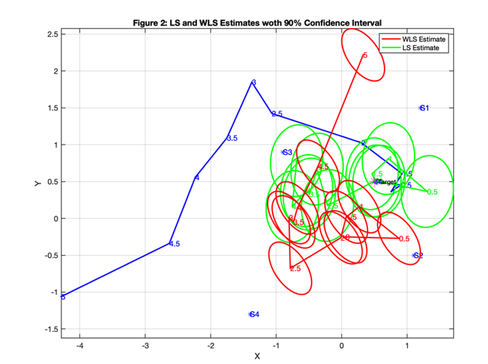

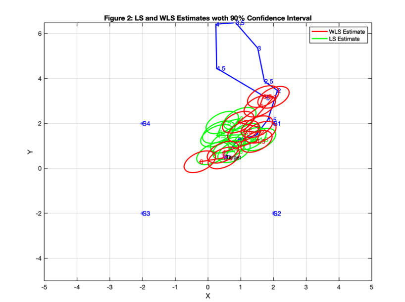

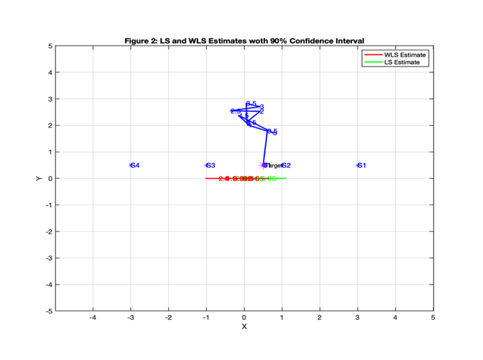

The results show that the estimation results were poor as the target moved around. In particular, the estimations for Scenario 3, where the sensors were in a straight line were the least performant.

### B. Tracking

The second step was to test the effectiveness of the filtering algorithms for tracking purposes.

#### 1) KF

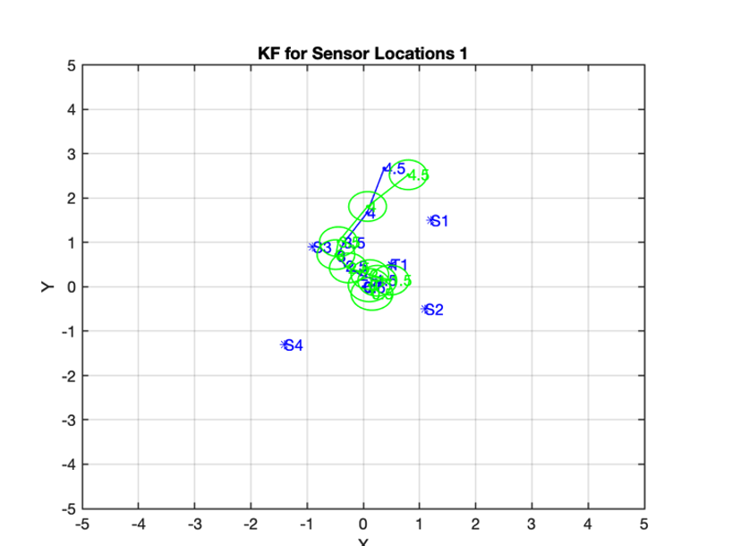

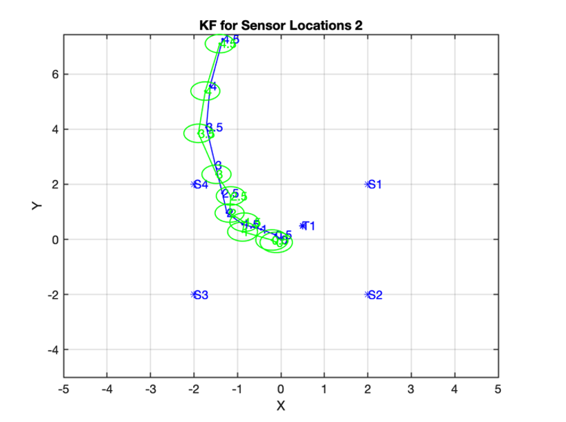

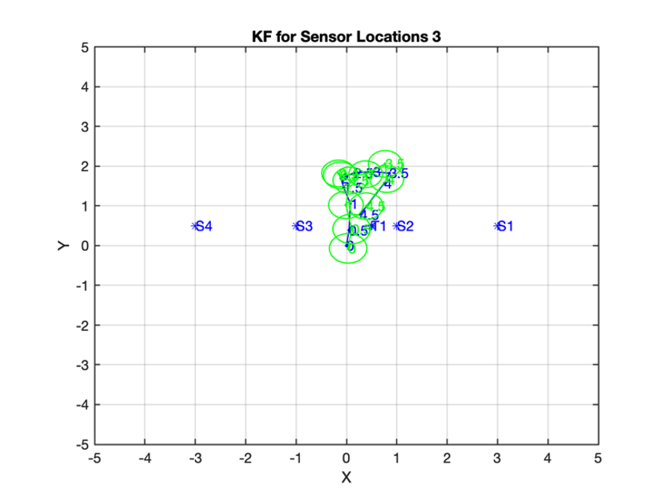

The results of the Kalman filter tracking are much better in comparison to the localization results from Section A. The sensor positions seemed to have had little impact in general. However, some inaccuracies occurred when the target drifted away from the group of sensors in Scenario 1 and 2.

#### 2) EKF

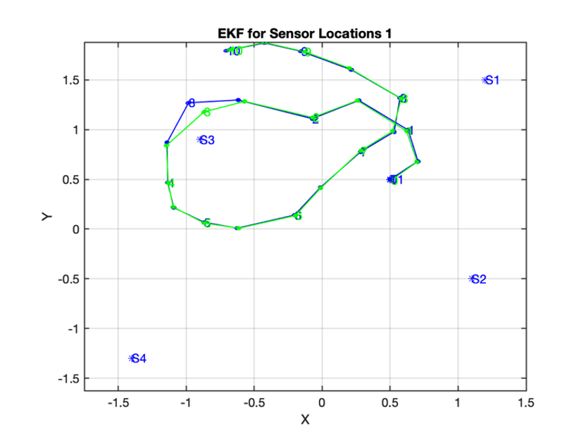

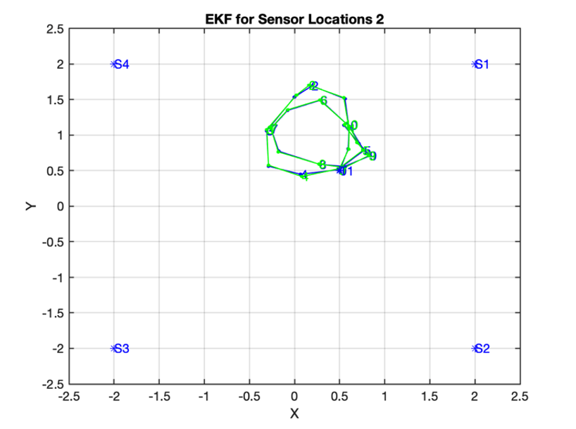

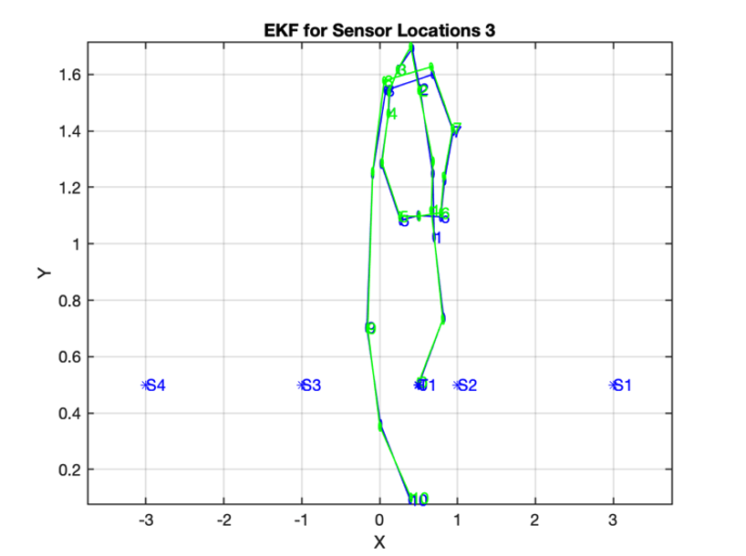

The extended Kalman filter performed well in each of the three sensor configurations. Scenario 2 provided the most accurate tracking estimations of the three and Scenario 3 had the largest deviations from the measured route taken by the target.

#### 3) UKF

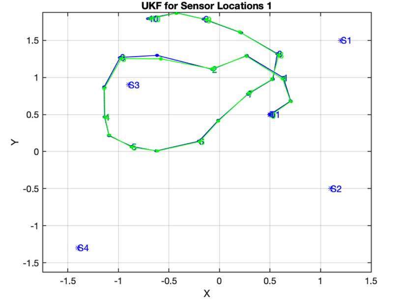

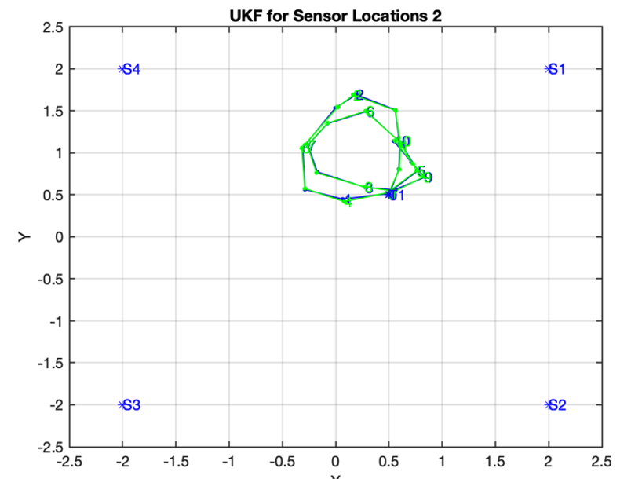

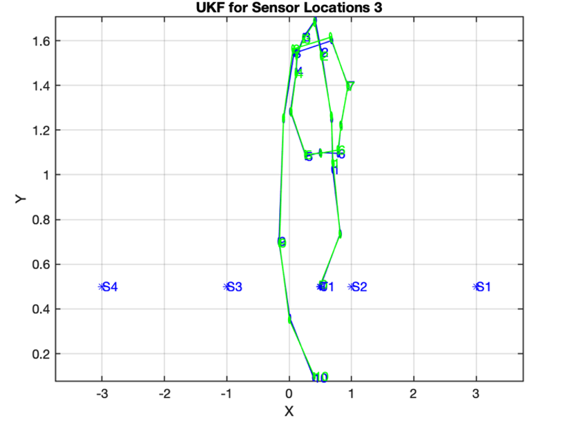

The UKF seemed to perform marginally better than the EKF with smaller estimation deviations from the simulated path. This is that the gaussian estimation of the non-linear function was more accurate than the linear approximation used in the extended Kalman filter.

#### 4) Particle Filter

The final filter to test was the particle filter. 1000 particles were used in the simulation and seemed to consume the most computational power when running the simulations. From the three sensor configurations investigated, each of the estimation sets were very poor. MATLAB reported errors that particles had been set to zero, therefor the assumption here is that particle degradation was the result of the poor outcome.

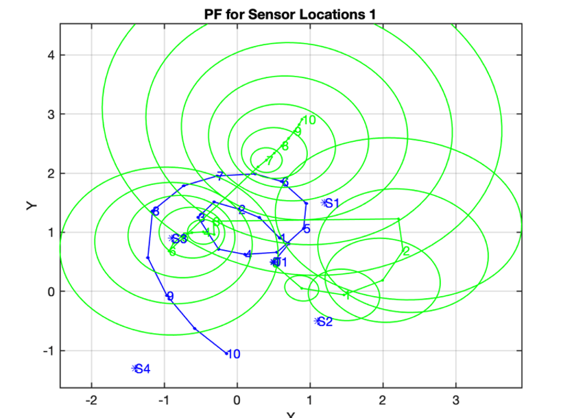

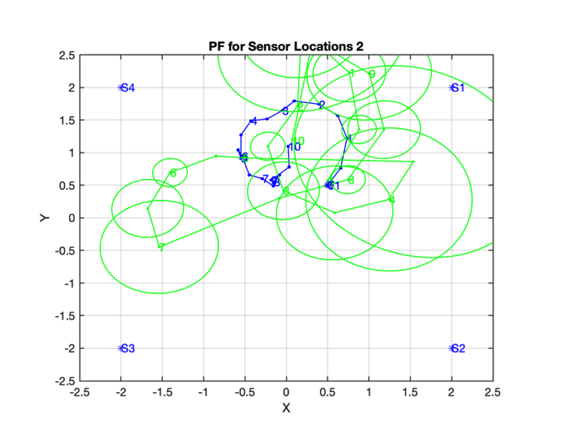

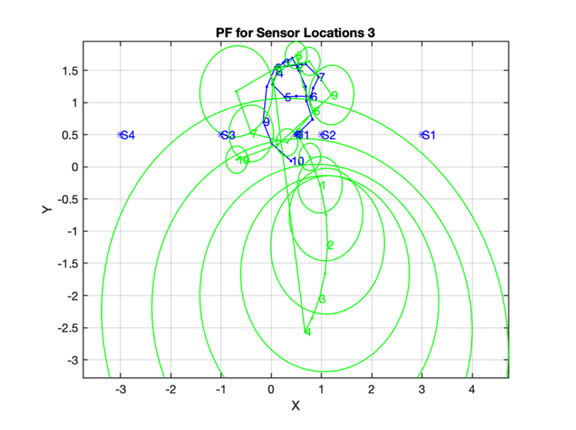

## V. Conclusion

There are many options when choosing an algorithm for localization and tracking. However, there are a number of factors that also need to be considered, whether the state estimation function can be represented linearly or not and how much computation is available. In this case the particle filter performed the worst out of the four algorithms investigated. Future research could test greater distances and formations of sensor networks to see . A longer time period could also be examined to determine if there are any degradations or error accumulations over a longer period.

## VI. Bibliography

[1]   Y. Kim and H. Bang, &quot;Introduction to Kalman Filter and Its Applications,&quot; July 2018. [Online]. Available: https://www.intechopen.com/books/introduction-and-implementations-of-the-kalman-filter/introduction-to-kalman-filter-and-its-applications. 

[2]   R. Kalman, &quot;A New Approach to Linear Filtering and Prediction Problems,&quot; _Transactions of the ASME–Journal of Basic Engineering,_ 1960. |

[3]   Stanford, &quot;The Extended Kalman filter,&quot; 2009. [Online]. Available: https://stanford.edu/class/ee363/lectures/ekf.pdf. |
